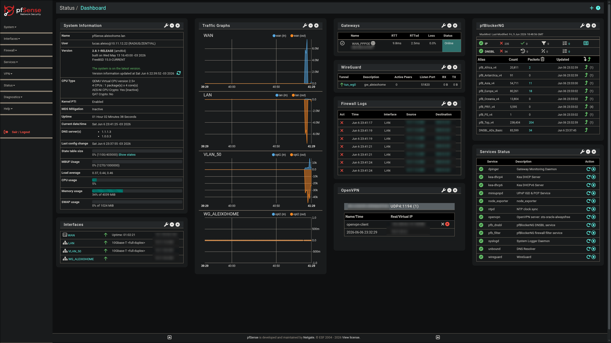

# pfSense Modern UI

This repository contains a CSS visual theme inspired by the "pfsense-modern-gui" (https://github.com/remotelyroot/pfsense-modern-gui) project, adapted to give the pfSense WebGUI a more modern, dark, and consistent appearance.



## What this CSS does

* Applies a dark theme based on `pfSense-dark.css`;
* Uses the Font Awesome library for more modern icons;
* Adjusts the sidebar, footer, cards, tables, buttons, and status indicators;
* Customizes the logo and navigation for a cleaner interface.

## Context

The `modern-ui.css` file was created to replace or complement the default pfSense look, maintaining the behavior of the administrative dashboard but providing a more updated visual identity.

It was designed for environments where the administrator wants to:

* Reduce the "classic" visual feel of the WebGUI;
* Improve readability with a dark palette;
* Keep navigation more organized and visually consistent.

## Requirements

* pfSense with WebGUI access;
* Permission to copy files into the system's CSS folder;
* A modern web browser with support for CSS and Font Awesome.

## How to configure the custom CSS in pfSense

Follow this step-by-step guide to apply the theme to the WebGUI:

### 1. Access pfSense

Log into the pfSense administrative dashboard with a user that has permission to edit files and system configurations.

### 2. Create the custom CSS file

In pfSense, run the following command in `Diagnostics > Command Prompt`:

```sh
touch /usr/local/www/css/modern-ui.css

```

This command creates the file that will hold the theme's content.

### 3. Add the CSS content

Open the file in `Diagnostics > Edit File` and paste the content of `modern-ui.css` (or the equivalent content of the theme you want to use) into the `/usr/local/www/css/modern-ui.css` file, then save it.

### 4. Activate the theme in pfSense

Go to:

* `System > General Setup`
* `WebConfigurator > Theme`

Change the theme to `modern-ui`.

### 5. Reload the interface

After saving the configuration:

* Clear your browser cache;
* Log out and log back in;
* Reload the WebGUI page.

## Important Notes

* This file uses external URLs for:
* Font Awesome (`cdnjs.cloudflare.com`);
* Logo image (My GitHub).


If you want a completely offline environment, replace these links with local files within `/usr/local/www/`.
* In older versions of pfSense, it may be necessary to adjust the theme name or the way the CSS is loaded.
* Tested on versions 2.7 and 2.8.1.


## Customization Tips

You can quickly change the main elements in the `modern-ui.css` file, such as:

* Main colors (`--color-primary`, `--color-surface`, `--color-bg`);
* Card border radius (`--border-radius`);
* Sidebar width (`--sidebar-width`);
* Main font (`--font-main`).

## Troubleshooting

If the visuals do not appear:

1. Confirm that the file was copied to `/usr/local/www/css/`;
2. Verify if the chosen theme is actually loading this CSS;
3. Confirm that pfSense is accessing the theme without import errors;
4. Test in another browser to rule out cache or CDN blocking issues.

## Summary

This theme is a simple and efficient way to modernize the pfSense WebGUI without altering the system's logic. Simply copy the file to the correct directory and associate it with the theme used in the interface.

> Some items might display poorly depending on your resolution, so adaptation to each scenario is necessary. For interface bugs, I will fix them over time. If needed, you can open an issue, and I will try to help as much as possible.